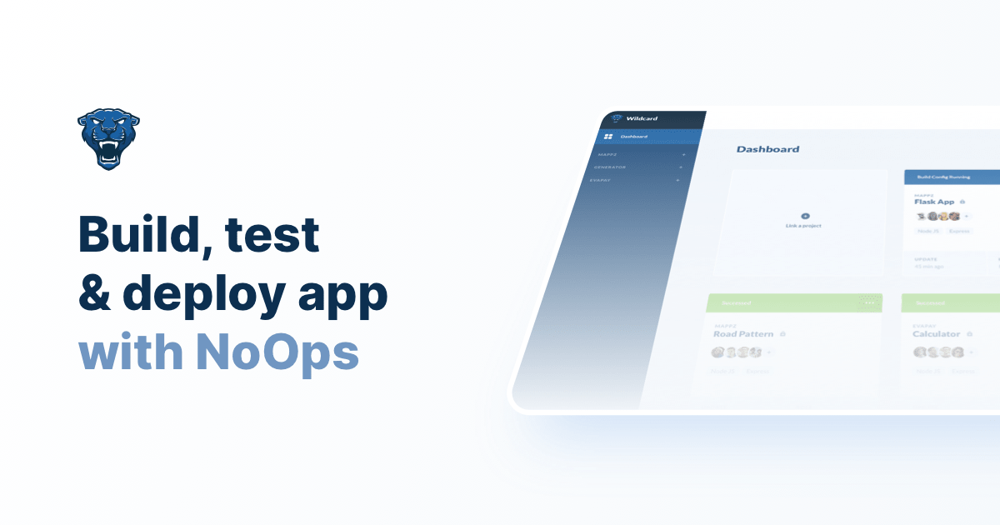

I started my internship at [Wildcard](https://w6d.io) and I put the [WildBlog](https://w6d.io/blog) and this [internal documentation](https://smickael.github.io/docinterne) online.

Here are some tips `blog` to write your upcoming tutorials.

Each blog article shoud follow those examples:

- `2019-05-30-welcome.md`
- `2019-05-30-welcome/index.md`

A blog post folder can be convenient to co-locate blog post images:

The blog supports tags as well!

**And if you don't want a blog**: just delete this directory, and use `blog: false` in your the `docusaurus.config.js`.
